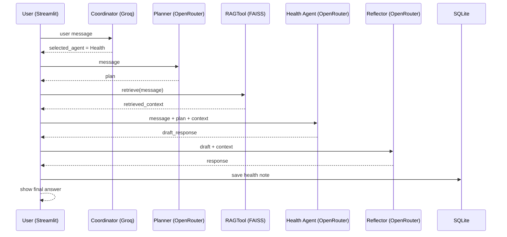
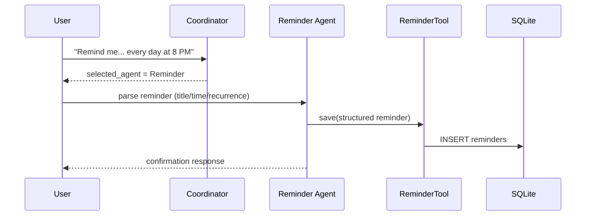

# CareMate AI

CareMate AI is a multi-agent elderly-care assistant built with **LangGraph**, **Streamlit**, **Groq**, **OpenRouter**, and a **FAISS RAG** knowledge base. It routes each user request to a specialist agent, can schedule medicine reminders with desktop alerts, and answers health questions using retrieved guidance documents.

> Educational prototype only. Not a substitute for professional medical care.

---

## Live Demo

Streamlit Community Cloud:

```
https://YOUR_APP_NAME.streamlit.app
```

*(Replace with your deployed URL after publishing on [Streamlit Community Cloud](https://share.streamlit.io/).)*

---

## Features

- Multi-agent routing (Coordinator → specialist agents)
- Medicine reminders with SQLite persistence, minute polling, Streamlit alerts, and Windows desktop notifications
- Health advice grounded by RAG retrieval
- Planning + Reflection on the Health path
- Conversation, summary, and emergency alert agents
- Streamlit chat UI with history and reminder popup

---

## Agentic Design Patterns

| Pattern | Where it appears |
|---------|------------------|
| **Router** | `CoordinatorAgent` in `agents/agents.py` |
| **Tool Use** | `ReminderTool`, `HealthTool`, `RAGTool` in `tools/tools.py` |
| **Planning** | `PlannerAgent` in `agents/agents.py` (Health path) |
| **Reflection** | `ReflectorAgent` in `agents/agents.py` (Health path) |
| **Orchestrator–Worker** | LangGraph in `workflow/graph.py` via shared `CareMateState` |

Health advice path:

```
User → Coordinator (Router)
         → Planner (Planning)
         → RAGTool (Tool Use / Retrieval)
         → HealthAgent (Reasoning model)
         → Reflector (Reflection)
         → Response
```

---

## System Architecture

```
                User
                  │
                  ▼
        Streamlit Web Interface
                  │
                  ▼
           LangGraph Workflow
                  │
                  ▼
        Coordinator Agent  (Groq routing model)
                  │
      ┌───────┬───┴────┬──────────┬─────────┐
      ▼       ▼        ▼          ▼         ▼
  Reminder  Health  Conversation Alert   Summary
      │       │
      │       ├── Planner
      │       ├── FAISS RAG
      │       └── Reflector
      ▼       ▼
   SQLite   Knowledge Base (22 docs)
```

---

## Agent-to-Agent Communication

Agents exchange **structured fields** in `CareMateState` (`workflow/graph.py`):

| Field | Meaning |
|-------|---------|
| `message` | User utterance |
| `selected_agent` | Coordinator routing decision |
| `plan` | Planner steps for Health |
| `retrieved_context` | RAG passages for Health |
| `draft_response` | Pre-reflection draft |
| `response` | Final user-facing answer |
| `chat_history` | Short in-session memory for Conversation |

### Sequence diagram



For Reminder create flow:



---

## Model Selection Strategy

CareMate uses **two providers / roles**:

| Role | Provider | Model | Used by | Why |
|------|----------|-------|---------|-----|
| **Routing / parse** | Groq | `llama-3.1-8b-instant` | Coordinator routing, Reminder JSON parse | Very low latency and cost for short labels / structured extract |
| **Reasoning** | OpenRouter | `meta-llama/llama-3.3-70b-instruct` | Health, Alert, Conversation, Summary, Planner, Reflector | Stronger quality for advice, safety-sensitive wording, planning, reflection |

### Comparison table

| Criterion | Groq `llama-3.1-8b-instant` | OpenRouter `llama-3.3-70b-instruct` |
|-----------|-----------------------------|--------------------------------------|
| Typical use | Routing, reminder parse | Health advice, alerts, summaries |
| Latency | Lower | Higher |
| Cost | Lower | Higher |
| Reasoning depth | Adequate for labels | Better for nuanced guidance |
| Failure handling | Primary for routing | Falls back to Groq if OpenRouter key/API fails |

Configured in `src/llm.py` (`provider="groq"` vs `provider="openrouter"`).

---

## RAG Integration

### Pipeline

1. **Corpus**: `knowledge/` — **22** elderly-care text documents (blood pressure, falls, medicines, emergencies, etc.)
2. **Chunking**: overlapping character chunks (`rag/pipeline.py`, size 400, overlap 80)
3. **Embeddings**: local `sentence-transformers/all-MiniLM-L6-v2` (`rag/pipeline.py`)
4. **Vector DB**: FAISS `IndexFlatIP` stored under `rag/index/`
5. **Retrieval**: top-k search via `RAGTool` inside the Health node
6. **Evaluation**: `python -m rag.evaluate` runs **5 queries** and writes `docs/rag_evaluation.json`

```
knowledge/*.txt
      │
      ▼
  Chunking
      │
      ▼
  MiniLM embeddings
      │
      ▼
  FAISS index
      │
      ▼
  Top-k passages → HealthAgent (+ Planner / Reflector)
```

### Build / evaluate

```bash
python -m rag.build_index
python -m rag.evaluate
```

### Retrieval evaluation (5 queries)

| # | Query focus | Expected source theme |
|---|-------------|------------------------|
| 1 | High blood pressure | `01_blood_pressure` |
| 2 | Fall prevention | `05_fall_prevention` |
| 3 | Medication safety | `04_medication_safety` |
| 4 | Low blood sugar | `02_blood_sugar` |
| 5 | Chest pain / emergency | `03_heart_health` / `20_emergency_red_flags` |

Hit-rate results are saved to `docs/rag_evaluation.json` after you run the evaluator locally (depends on the built index).

**Latest local run: 5/5 hits (100%).** See `docs/rag_evaluation.md`.

---

## Technologies Used

| Technology | Purpose |
|------------|---------|
| Python | Backend |
| Streamlit | Web UI |
| LangGraph | Multi-agent workflow |
| Groq API | Fast routing model |
| OpenRouter API | Reasoning model |
| FAISS | Vector database |
| sentence-transformers | Embeddings |
| SQLite | Persistence |
| plyer | Windows desktop notifications |
| python-dotenv | Secrets via environment variables |

---

## Project Structure

```
caremate-agentic-ai/
├── agents/agents.py     # All agents (Router, Planner, Reflector, workers)
├── tools/tools.py       # Reminder, Health, RAG tools
├── workflow/graph.py    # CareMateState + LangGraph nodes/edges
├── rag/                 # pipeline, build_index, evaluate
├── knowledge/           # 22 RAG source documents
├── database/database.py # SQLite helpers
├── utils/reminders.py   # Reminder scheduling / notifications
├── src/                 # llm.py, prompts.py
├── docs/                # RAG evaluation results
├── images/
├── streamlit_app.py
├── requirements.txt
└── README.md
```

---

## Installation

```bash
git clone https://github.com/YOUR_USERNAME/caremate-agentic-ai.git
cd caremate-agentic-ai
python -m venv .venv
```

Windows:

```bash
.venv\Scripts\activate
pip install -r requirements.txt
python -m rag.build_index
```

---

## Environment Variables (Secrets)

Copy the template and fill in **local** secrets (do **not** commit `.env`):

```bash
copy .env.example .env
```

```
GROQ_API_KEY=your_groq_api_key_here
OPENROUTER_API_KEY=your_openrouter_api_key_here
```

`.env` is listed in `.gitignore`. For Streamlit Cloud, add the same keys under **App settings → Secrets**.

---

## Running the Application

```bash
streamlit run streamlit_app.py
```

---

## Example Questions

- Remind me to take my blood pressure medicine every day at 8 PM
- Show my reminders
- I have a headache
- How can I prevent falls at home?
- I feel stressed
- Summarize our conversation
- I have severe chest pain

---

## Database

SQLite (`caremate.db`) stores:

- Chat sessions / messages
- Structured reminders (`title`, `remind_at`, `recurrence`, `status`)
- Health notes and summaries

---

## Known Limitations

- Not a medical device; advice is general and may be incomplete
- RAG corpus is a small curated set (22 docs), not a full clinical library
- Reminder notifications fire only while the Streamlit app is open
- Desktop toasts depend on OS notification permissions (`plyer` / Windows toast fallback)
- OpenRouter outages fall back to the Groq routing model (quality may drop)
- No user authentication or multi-tenant isolation
- Streamlit Cloud free tier may sleep; cold starts rebuild/load the FAISS index

---

## Future Improvements

- Voice input/output
- Larger clinical knowledge base with citation UI
- Persistent background reminder worker
- Caregiver accounts and sharing
- Multilingual support

---

## Author

**Ishan Indrajith**  
BSc (Hons) Information Technology

---

## License

Developed for academic purposes.
